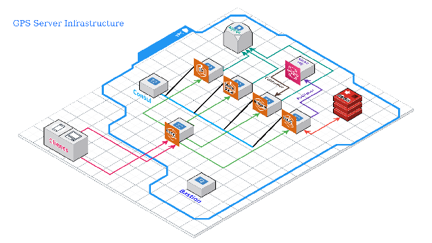

# Realtime GPS Server

A re-implementation of the **Realtime Location Service (RLS) GPS Server** as Spring Boot
microservices on Java 21.

## How this repository is built

The platform is delivered **one small, self-contained commit at a time**. Every commit:

- compiles and passes its tests (`./scripts/build.sh`),
- does one reviewable thing, and
- updates this README, so the README always describes exactly what exists at that commit.

Commits are grouped into milestones (`C1`, `C2`, …); individual commits are numbered within a
milestone (`C1.1`, `C1.2`, …). The **Commit log** at the bottom is the running history.

---

## Tech stack

| Concern | Choice |
|---|---|
| Language / runtime | Java 21 (LTS) |
| Framework | Spring Boot 3.5.15 |
| Distributed config & discovery | Spring Cloud 2025.0.3 + Consul |
| Build | Maven multi-module |
| Tests | JUnit 5, AssertJ, Testcontainers (`*IT`) |

---

## Building

Prerequisites: **JDK 21** and **Maven 3.9+**.

Maven on the development machine defaults to JDK 17, so use the wrapper script — it pins
`JAVA_HOME` to JDK 21 before delegating to Maven:

```bash
./scripts/build.sh
```

```bash
./scripts/build.sh -DskipTests package
```

If your JDK 21 is installed somewhere other than `C:/Program Files/Java/jdk-21`, set
`GPS_JAVA_HOME` first. Plain `mvn verify` works too when your own `JAVA_HOME` is already a JDK 21.

**Test conventions:** `*Test` = unit/slice tests (surefire, `mvn test`); `*IT` = Testcontainers
integration tests (failsafe, `mvn verify`). Coverage reports land in `target/site/jacoco`.

---

## Repository layout

```
realtime-gps/
├── pom.xml                  # parent POM: Java 21, Spring Boot/Cloud BOMs, surefire/failsafe/jacoco
├── libs/gps-common/         # shared library every service depends on
├── services/id-service/     # authentication and authorization
├── deploy/                  # docker-compose stack, MySQL init SQL, Consul KV seed files
├── scripts/                 # build.sh (JDK 21), up.sh / down.sh / seed.sh (local stack)
└── docs/images/             # architecture diagram from the original spec
```

---

## The system being built



The platform ingests high-volume user location pings, caches each user's last known position for
radius queries, streams every position through a message queue into durable storage, and serves
location history and per-user metadata — all behind an API gateway that authenticates every call.
The requirements are in [`GPS SERVER.md`](GPS%20SERVER.md).

```
                    ┌──────────────────────── Kong (:8000) ────────────────────────┐
   Clients ────────►│  rls_auth plugin ──► id-service /api/v1/internal/authenticate │
                    └───┬───────────────┬───────────────┬──────────────────────────┘
                        │               │               │
                 ping-service    history-service   metadata-service      id-service
                        │               ▲                │                    │
                 Redis  │               │ RabbitMQ       │ MySQL              │ MySQL
             (last loc, │               │ (sole          │ gps_metadata       │ gps_id
              GEO index)└──► RabbitMQ ──┘  consumer)     │                    │
                                         └──► MySQL gps_history

  Consul: configuration (KV) + service registry + DNS used by Kong to resolve upstreams
```

| Service | Responsibility |
|---|---|
| **Ping** | Receives all location pings. Buffers them in memory, publishes them to RabbitMQ in bulk, keeps each user's *last* location in Redis, answers radius queries. |
| **History** | The **only** RabbitMQ consumer. Writes locations to MySQL and serves location history. |
| **Id** | Companies, users, tokens, and the gateway's authenticate hook. |
| **Metadata** | Dynamic per-user JSON metadata with a MATCH/EXCEPT/ANY/ALL query language. |
| **Gateway (Kong)** | The only public entry point; restricted endpoints are never routed through it. |

## Milestones

| # | Milestone | Commits | Status |
|---|---|---|---|
| C1 | Scaffolding + `gps-common` shared library | C1.1 – C1.8 | ✅ done |
| C2 | Local infrastructure (MySQL, Redis, RabbitMQ, Consul) | C2.1 – C2.4 | 🟡 written, not yet run¹ |
| C3 | Id service — company signup | C3.1 – C3.6 | ✅ done (ITs pending Docker¹) |
| C4 | Id service — users, tokens, internal authenticate | C4.1 – C4.6 | ✅ done (ITs pending Docker¹) |
| C5 | Kong gateway + `rls_auth` plugin | C5.1 – C5.5 | 🟡 config tested; runtime pending Docker¹ |
| C6 | Ping service — Redis write path | C6.1 – C6.4 | ✅ done (ITs pending Docker¹) |
| C7 | Ping service — buffer → RabbitMQ bulk publish | C7.1 – C7.4 | ✅ done (ITs pending Docker¹) |
| C8 | Ping service — radius search | C8.1 – C8.2 | ✅ done (ITs pending Docker¹) |
| C9 | History service — queue consumer → MySQL | C9.1 – C9.4 | ⬜ planned |
| C10 | History service — history API | C10.1 – C10.2 | ⬜ planned |
| C11 | Metadata service — CRUD | C11.1 – C11.5 | ⬜ planned |
| C12 | Metadata service — MATCH/EXCEPT/ANY/ALL search | C12.1 – C12.5 | ⬜ planned |
| C13 | Observability, resilience, OpenAPI | C13.1 – C13.4 | ⬜ planned |
| C14 | End-to-end suite + load harness | C14.1 – C14.3 | ⬜ planned |

¹ Anything needing containers is unverified at runtime: the Docker daemon will not start on this
machine (its WSL disk image is missing). Compose definitions are validated with `docker compose config`
and shell scripts are syntax-checked; Testcontainers integration tests are written and compile, but
report as *skipped* rather than passing. They run for real as soon as Docker works.

---

## Running the local stack

Requires **Docker Desktop running**.

```bash
./scripts/up.sh
```

```bash
./scripts/down.sh
```

`up.sh` starts every container, waits for its health check, and re-seeds Consul KV. `down.sh -v`
also discards the MySQL/Redis/RabbitMQ data volumes for a clean slate.

---

## Shared library — `libs/gps-common`

Every service depends on this module, so cross-cutting behaviour is defined once.

### Vocabulary

[`GpsHeaders`](libs/gps-common/src/main/java/com/rls/gps/common/web/GpsHeaders.java) names the
headers exchanged between Kong and the services. The identity headers — `X-Company-Id`,
`X-User-Id`, `X-App-Key` — are **never** trusted from a client: the gateway strips whatever the
caller sent and re-injects the values it verified.

[`Identity`](libs/gps-common/src/main/java/com/rls/gps/common/security/Identity.java) is the
immutable caller identity carried on every downstream request. `isComplete()` (company **and** user
present, non-blank) is what "authenticated" means to a service.

### What a service gets for free

Depend on the module and the auto-configuration supplies all of this — no imports, no boilerplate:

| Capability | Type | Behaviour |
|---|---|---|
| `GET /api/v1/ping` | `PingController` | service name, status, build version; unauthenticated for probes |
| Gateway trust check | `GatewayTokenFilter` | constant-time shared-secret check; 401 if the request did not come through Kong |
| Identity injection | `IdentityFilter`, `@CurrentIdentity` | headers → `Identity` + MDC; 401 when an endpoint needs one and there is none |
| Correlation ids | `CorrelationIdFilter` | adopt/mint, MDC, response header, `traceId` in errors |
| Errors | `GlobalExceptionHandler`, `ProblemWriter` | RFC 7807 with a stable `code` |

Filter order is correlation id (`HIGHEST+10`) → gateway token (`+20`) → identity (`+30`), so even a
rejected request is logged with a trace id.

Configuration ([`GpsCommonProperties`](libs/gps-common/src/main/java/com/rls/gps/common/config/GpsCommonProperties.java)):

| Property | Default | Purpose |
|---|---|---|
| `gps.common.gateway.token` | *(empty — check disabled)* | shared secret Kong presents |
| `gps.common.gateway.skip-paths` | `/actuator/**`, `/api/v1/ping`, `/v3/api-docs/**`, `/swagger-ui/**`, `/error` | paths exempt from the check |

---

## Id service — `services/id-service`

Authentication and authorization: companies (tenants), and later users, tokens and the gateway's
authenticate hook. Runs on **two ports** — `8081` public (Kong proxies here) and `9081` internal
(restricted endpoints, never routed by Kong).

### `POST /api/v1/company/signup` — restricted

Registers a tenant. Requires the `sret` header and is served **only on the internal port**.

```bash
curl -i -X POST http://localhost:9081/api/v1/company/signup \
  -H 'sret: local-dev-server-secret' \
  -H 'Content-Type: application/json' \
  -d '{"name":"Acme Logistics","contactEmail":"ops@acme.example"}'
```

```json
{
  "companyId": "0a9f…",
  "name": "Acme Logistics",
  "contactEmail": "ops@acme.example",
  "appKey": "ak_8Fq2…",
  "appSecret": "as_9Xk1…",
  "status": "ACTIVE",
  "createdAt": "2026-09-16T10:12:05.123Z"
}
```

**`appSecret` is shown exactly once.** Only its BCrypt hash is stored, so a lost secret means
re-issuing, never recovering.

| Outcome | Status | `code` |
|---|---|---|
| Registered | 201 | — |
| Missing or wrong `sret` | 403 | `invalid_server_secret` |
| No server secret configured | 503 | `server_secret_not_configured` |
| Name already taken (case-insensitive) | 409 | `company_already_exists` |
| Invalid body | 400 | `validation_failed` |
| Called on the public port | 404 | `not_found` |

### `POST /api/v1/user/signup` — public

Registers a user for a company, authenticated with that company's app key **and secret** in the body.
Kong exempts this route from `rls_auth` (there is no user yet to authenticate).

```bash
curl -s -X POST http://localhost:8081/api/v1/user/signup -H 'Content-Type: application/json' \
  -d '{"appKey":"ak_…","appSecret":"as_…","username":"driver-1","password":"s3cret-password"}'
```

### `POST /api/v1/auth/token` — public *(added; see Deviations)*

Exchanges `appKey` + `username` + `password` for a Bearer token. No app secret: the caller is an
end-user client that cannot keep one.

```bash
TOKEN=$(curl -s -X POST http://localhost:8081/api/v1/auth/token -H 'Content-Type: application/json' \
  -d '{"appKey":"ak_…","username":"driver-1","password":"s3cret-password"}' | jq -r .accessToken)
```

### `GET /api/v1/user/resolve` — public

Lists the caller's company users, paged (`page`, `size` ≤ 200), ordered by username. The company
comes from the **verified identity**, never the query string, so no app key can read another
tenant's users; an `appKey` parameter is accepted (the spec names it) but only checked for agreement
with the caller.

```bash
curl -s "http://localhost:8000/api/v1/user/resolve?page=0&size=50" -H "Authorization: Bearer $TOKEN"
```

### `GET /api/v1/internal/authenticate` — restricted

The gateway's hook. Returns 200 with `X-Company-Id` / `X-User-Id` / `X-App-Key` response headers and
an `X-Token-Expires-In` that bounds how long the plugin may cache the decision.

### Error codes

| Endpoint | Outcome | Status | `code` |
|---|---|---|---|
| company signup | missing/wrong `sret` | 403 | `invalid_server_secret` |
| company signup | no server secret configured | 503 | `server_secret_not_configured` |
| company signup | name taken | 409 | `company_already_exists` |
| user signup | bad app key **or** secret | 401 | `invalid_company_credentials` |
| user signup | username taken in that company | 409 | `user_already_exists` |
| auth token | bad app key, username **or** password | 401 | `invalid_credentials` |
| auth token / authenticate | user disabled | 403 | `user_disabled` |
| any | company suspended | 403 | `company_suspended` |
| authenticate | no/!Bearer header | 401 | `token_missing` |
| authenticate | bad signature, tampered, `alg:none`, unknown user | 401 | `token_invalid` |
| authenticate | expired | 401 | `token_expired` |
| resolve | app key of another company | 403 | `app_key_mismatch` |
| resolve | called without identity | 401 | `identity_required` |
| any | invalid body or parameters | 400 | `validation_failed` |

### Configuration

| Property | Source | Default |
|---|---|---|
| `gps.id.internal-port` | `INTERNAL_PORT` env | `9081` |
| `gps.id.server-secret` | Consul KV `config/id-service/data` | *(blank → signup refused)* |
| `gps.id.jwt.secret` | Consul KV `config/id-service/data` | *(blank → random key + warning)* |
| `gps.id.jwt.issuer` / `.ttl` | Consul KV | `rls-id-service` / `1h` |
| datasource host/port/credentials | `MYSQL_*` env | `localhost:3306`, `gps_id` |

---

## Ping service — `services/ping-service`

The write path. Every position a device reports arrives here; Redis holds the last one per user.

### `POST /api/v1/locations`

```bash
curl -i -X POST http://localhost:8000/api/v1/locations -H "Authorization: Bearer $TOKEN" \
  -H 'Content-Type: application/json' \
  -d '{"locations":[{"latitude":23.7808,"longitude":90.4019,"recordedAt":"2026-09-16T10:00:00Z"}]}'
```

A batch of 1–500 fixes for the **authenticated** user — there is no user field in the payload.
`recordedAt` is optional (server time is used when absent) but must not be more than five minutes in
the future. Answers `202` with `{"accepted": n, "lastLocationUpdated": bool}`.

### `GET /api/v1/locations?userIds=…`

```bash
curl -s "http://localhost:8000/api/v1/locations?userIds=user-1,user-2" -H "Authorization: Bearer $TOKEN"
```

```json
{
  "locations": [
    { "userId": "user-1", "latitude": 23.7808, "longitude": 90.4019,
      "recordedAt": "2026-09-16T10:00:00Z", "receivedAt": "2026-09-16T10:00:01.412Z",
      "accuracy": 5.0, "speed": null, "heading": null }
  ],
  "missing": ["user-2"]
}
```

Up to 100 users per call, scoped to the caller's company, one `MGET` behind the scenes. Users with
nothing stored come back in `missing` rather than being silently dropped.

### `GET /api/v1/locations/users?lat=&lon=&radius=&unit=&limit=`

```bash
curl -s "http://localhost:8000/api/v1/locations/users?lat=23.7381&lon=90.3956&radius=5&unit=KM" \
  -H "Authorization: Bearer $TOKEN"
```

```json
{
  "latitude": 23.7381, "longitude": 90.3956, "radius": 5.0, "unit": "KM", "count": 2,
  "users": [
    { "userId": "at-shahbagh", "latitude": 23.7381, "longitude": 90.3956,
      "recordedAt": "2026-09-16T10:00:00Z", "receivedAt": "2026-09-16T10:00:01Z", "distance": 0.0 },
    { "userId": "in-dhanmondi", "latitude": 23.7461, "longitude": 90.3742,
      "recordedAt": "2026-09-16T09:58:12Z", "receivedAt": "2026-09-16T09:58:13Z", "distance": 2.31 }
  ]
}
```

Nearest first, company-scoped, `unit` ∈ `M|KM|MI|FT` (default `KM`), `limit` ≤ 100 (default 50).
A device that stopped reporting drops out once its entry expires rather than haunting the map at its
final position. The radius ceiling (`gps.ping.search.max-radius-km`, default 100 km) is checked
**after converting to kilometres**, so `radius=5000000&unit=M` is refused exactly like `radius=5000`.

### Redis key schema

| Key | Type | Contents |
|---|---|---|
| `gps:{companyId}:last:{userId}` | string | Location JSON, TTL `gps.ping.redis.last-location-ttl` (24 h) |
| `gps:{companyId}:geo` | geo set | member = `userId`, for radius queries (C8) |

Writes go through [`last-location-upsert.lua`](services/ping-service/src/main/resources/redis/last-location-upsert.lua),
which refuses to replace a newer fix with an older one.

| Property | Default | Purpose |
|---|---|---|
| `gps.ping.redis.key-prefix` | `gps` | namespace for every key |
| `gps.ping.redis.last-location-ttl` | `24h` | how long a silent user stays visible |
| `gps.ping.max-clock-skew` | `5m` | how far into the future a `recordedAt` may be |

---

## Gateway — `gateway/kong`

Kong runs DB-less: [`kong.yml`](gateway/kong/kong.yml) *is* the gateway. Nothing is configured
through the Admin API at runtime, so every routing change is a reviewable diff.

### Route table

| Route | Method | Auth | Notes |
|---|---|---|---|
| `/api/v1/user/signup` | POST | **public** | No user exists yet; authenticates with company credentials in the body |
| `/api/v1/auth/token` | POST | **public** | Where tokens come from; rate limited to 10/min per IP |
| `/api/v1/user/resolve` | GET | `rls_auth` | Company scoped from the verified identity |
| `/api/v1/company/**` | — | **no route** | Restricted: internal port only |
| `/api/v1/internal/**` | — | **no route** | Restricted: internal port only |

Ping endpoints are intentionally not routed: they are liveness probes for Consul and Compose, not a
public API. Kong's own health is `curl localhost:8001/status`.

### The trust boundary, in order

1. `request-transformer` (priority 801) removes `X-Company-Id`, `X-User-Id`, `X-App-Key` and
   `X-Gateway-Token` from the incoming request, then adds the real gateway token.
2. `rls_auth` (priority 800) resolves the `Authorization` header via the Id service's internal port
   and sets the verified identity headers.
3. The service checks `X-Gateway-Token` ([`GatewayTokenFilter`](libs/gps-common/src/main/java/com/rls/gps/common/security/GatewayTokenFilter.java))
   and reads the identity ([`IdentityFilter`](libs/gps-common/src/main/java/com/rls/gps/common/security/IdentityFilter.java)).

So a client's identity headers are stripped before anything reads them, a direct call to a service
port is rejected for lacking the gateway token, and only `rls_auth` can assert who someone is.

### Upstream resolution

Services are addressed by Docker DNS (`http://id-service:8081`). The original AWS deployment
resolved upstreams through Consul DNS; to match it, set `KONG_DNS_RESOLVER=consul:8600` on the Kong
container and change the service URL to `http://id-service.service.consul` (no port — Kong takes it
from the SRV record Consul publishes). Compose DNS is the default here because it has one less
moving part while the stack is being brought up.

### Adding a route

Add it under the right service in `kong.yml`, and either apply `rls_auth` or add its name to
`PUBLIC_ROUTES` in
[`KongDeclarativeConfigTest`](gateway/kong/src/test/java/com/rls/gps/gateway/KongDeclarativeConfigTest.java).
The build fails otherwise — which is the point.

```bash
./scripts/up.sh && ./scripts/smoke-gateway.sh
```

---

## Commit log

### C1.1 — Maven reactor and JDK-pinned build script

Creates the multi-module reactor: parent POM on Java 21 with the Spring Boot 3.5.15 parent and the
Spring Cloud 2025.0.3 BOM, a surefire/failsafe split so unit and integration tests run in different
phases, JaCoCo coverage, and the empty `gps-common` module the next commits fill in.
`scripts/build.sh` exists because Maven here runs on JDK 17 by default.

*Verify:* `./scripts/build.sh` → `BUILD SUCCESS`.

### C1.2 — Original specification and architecture diagram

Adds the source requirements to the repository so the implementation can be checked against them:
the specification document, its PDF original, and the infrastructure diagram (extracted from the
PDF) that the README now shows. Also records the milestone breakdown this build follows.

*Verify:* nothing to run — documentation only.

### C1.3 — Shared identity and header vocabulary

The types every later commit speaks in: `GpsHeaders` (the Kong ↔ service header contract),
`Identity` (company + user + app key, with blank-safe `isComplete()`), and `RequestPaths` (request
path relative to the context path, for filter pattern matching). No Spring wiring yet — these are
plain types with unit tests.

*Verify:* `./scripts/build.sh test` → 6 tests in `gps-common`.

### C1.4 — RFC 7807 error model

Every failure in every service now renders as `application/problem+json` with a stable,
machine-readable `code`, a `timestamp`, and (from C1.5) a `traceId`:

```json
{
  "type": "https://docs.rls.gps/errors/validation_failed",
  "title": "Bad Request",
  "status": 400,
  "detail": "Request validation failed",
  "code": "validation_failed",
  "errors": ["count: must be greater than or equal to 1", "name: must not be blank"],
  "timestamp": "2026-09-14T13:22:05Z"
}
```

- `ApiException` / `ApiExceptions` — services throw `ApiExceptions.notFound("company_not_found", …)`
  and the status and code travel with the exception.
- `GlobalExceptionHandler` — extends Spring's `ResponseEntityExceptionHandler`, so framework
  failures (405, 415, malformed JSON) get the same shape. Bean Validation failures list every
  offending field. Unexpected exceptions become a generic `internal_error`; the stack trace goes to
  the log, never to the client.
- `ProblemWriter` — the same rendering for servlet filters, which run outside the advice chain.
- `GpsCommonAutoConfiguration` — registers the above through
  `META-INF/spring/…AutoConfiguration.imports`, so a service gets it by depending on the module.

*Verify:* `./scripts/build.sh test` → `ProblemDetailErrorsTest` (4 tests).

### C1.5 — Correlation ids across every hop

`CorrelationIdFilter` adopts the id Kong sends (`X-Correlation-Id`, falling back to
`X-Request-Id`) or mints a UUID, publishes it to the logging MDC for the whole request, echoes it
on the response, and — because `GlobalExceptionHandler` and `ProblemWriter` read the same MDC key —
stamps it into every error body as `traceId`.

That is what makes a single request traceable across Kong → ping → RabbitMQ → history, and lets a
user quote one id in a bug report.

*Verify:* `./scripts/build.sh test` → `CorrelationIdFilterTest` (3 tests).

### C1.6 — Identity propagation into controllers

`IdentityFilter` turns the gateway's headers into an immutable `Identity` request attribute and
pushes `companyId`/`userId` into the MDC, so every log line for the request says who it was for.
`IdentityArgumentResolver` then injects it straight into controller methods:

```java
@GetMapping("/api/v1/history")
List<Location> history(@CurrentIdentity Identity caller) { ... }
```

A request without a complete identity is rejected with a 401 `identity_required` problem *before*
the controller body runs, so no endpoint can forget the check. `@CurrentIdentity(required = false)`
opts an endpoint into anonymous access.

*Verify:* `./scripts/build.sh test` → `IdentityResolutionTest` (4 tests).

### C1.7 — Shared `GET /api/v1/ping` endpoint

The spec requires this endpoint on all four services, so it ships in the shared library rather than
being copy-pasted four times. It reports the service name (`spring.application.name`), status and
build version, and stays unauthenticated so Consul, Kong and load balancers can probe it:

```json
{ "service": "id-service", "status": "UP", "version": "0.1.0", "timestamp": "2026-09-14T13:22:05Z" }
```

*Verify:* `./scripts/build.sh test` → `PingEndpointTest`.

### C1.8 — Gateway trust boundary

Downstream services trust `X-User-Id` only because Kong verified it. That is safe only if a service
cannot be called directly, so `GatewayTokenFilter` requires a shared secret
(`gps.common.gateway.token`, seeded from Consul KV) that only Kong knows. The comparison is
constant-time, failures render as a 401 `gateway_token_invalid` problem, and health/doc paths
(`gps.common.gateway.skip-paths`) stay open so probes keep working.

The check disables itself when no token is configured, which keeps local runs and tests simple
without weakening a deployed environment.

This completes the shared library. Filter order: correlation id → gateway token → identity, so even
a rejected request is logged with a trace id.

*Verify:* `./scripts/build.sh test` → 22 tests in `gps-common`.

### C2.1 — MySQL with a schema per service

Starts the local infrastructure stack with MySQL 8 — the stand-in for RDS in the original design.
[`01-schemas.sql`](deploy/mysql/init/01-schemas.sql) runs on first boot and creates one schema and
one user per service: `gps_id`, `gps_history`, `gps_metadata`.

Separate schemas mean no service can read another's tables by accident and each keeps its own Flyway
history. (Ping needs no schema — its state lives in Redis and the queue.)

`scripts/up.sh` starts the stack and waits for health checks; `scripts/down.sh` stops it, with `-v`
to discard the data volumes.

*Verify:* `./scripts/up.sh` → `gps-mysql` healthy, then
`docker exec gps-mysql mysql -uroot -prootpw -e "SHOW DATABASES"` lists the three schemas.

### C2.2 — Redis for last-known locations

Redis is where the ping service will keep each user's *last* position plus the geo index that
answers radius queries. Two deliberate settings:

- `--maxmemory-policy noeviction` — the default LRU policy would let Redis silently drop geo
  entries under pressure, which shows up as a user disappearing from a radius result rather than as
  an error. Failing loudly is better.
- `--appendonly yes` — a restart during development shouldn't wipe the cache.

The original spec pinned Redis 5.0.6; this uses Redis 7 so radius queries can use `GEOSEARCH`
(`GEORADIUS`, deprecated in 6.2, is the fallback if you must stay on 5.x).

*Verify:* `./scripts/up.sh redis` → `gps-redis` healthy, `docker exec gps-redis redis-cli ping`
returns `PONG`.

### C2.3 — RabbitMQ for the location pipeline

The queue between ping (publisher) and history (the spec's single consumer). The management UI is
published at <http://localhost:15672> (`gps` / `gps_pw`) so you can watch depth and throughput while
load testing.

**Topology is owned by the services, not by this file.** Exchanges, queues, bindings and
dead-letter arguments are declared by the ping and history services (C7, C9), so the same
declarations apply in Docker Compose and in Testcontainers tests. Splitting them — definitions file
here, `@Bean`s there — is how you end up with a `PRECONDITION_FAILED` on a mismatched argument. This
file only provides the broker and its credentials.

*Verify:* `./scripts/up.sh rabbitmq` → `gps-rabbitmq` healthy;
`docker exec gps-rabbitmq rabbitmq-diagnostics -q ping` reports `Ping succeeded`.

### C2.4 — Consul for configuration and discovery

The last piece of infrastructure. Consul holds service configuration in its KV store and acts as
the service registry; Kong will later resolve upstreams through its DNS on port 8600.

`scripts/seed.sh` pushes every `deploy/consul/kv/<name>.yml` to `config/<name>/data` — exactly where
Spring Cloud Consul Config looks for it (`config/application/data` for shared settings,
`config/<spring.application.name>/data` for per-service overrides). Consul runs in `-dev` mode, so
its KV is in-memory and `up.sh` re-seeds on every start, which also makes the seed idempotent by
construction.

**The split that matters:** infrastructure *endpoints* (database host, broker host) come from
environment variables set by Compose, because they differ between a container and a JVM running on
your machine. *Behaviour and secrets* (gateway token, `sret`, tuning knobs) come from Consul KV, so
one set of values serves both. Mixing the two is how you get a service that works in Docker and
fails on localhost.

This completes the local infrastructure stack:

| Component | Port(s) | Credentials | Notes |
|---|---|---|---|
| MySQL | 3306 | `root`/`rootpw`, per-service users | schemas `gps_id`, `gps_history`, `gps_metadata` |
| Redis | 6379 | — | `noeviction`, AOF on |
| RabbitMQ | 5672, UI 15672 | `gps`/`gps_pw` | topology declared by the services |
| Consul | 8500 (UI), 8600 (DNS) | — | `-dev` mode, KV re-seeded by `up.sh` |

*Verify:* `./scripts/up.sh` → four healthy containers and `Seeded 1 key(s)`; the value is visible at
<http://localhost:8500/ui/dc1/kv/config/application/data> or via
`curl -s localhost:8500/v1/kv/config/application/data?raw`.

### C3.1 — Id service skeleton

The first service. It registers with Consul, reads its configuration from Consul KV, ships a
Dockerfile and a Compose entry, and already answers `GET /api/v1/ping` — inherited from
`gps-common`, not written again here.

Deliberately **no database yet**: a skeleton without JPA boots without any container, so this commit
is fully testable on a machine with no Docker, and the persistence layer arrives next with its own
tests. Consul is configured with `fail-fast: false` and an `optional:` config import for the same
reason — a developer running one service on their laptop shouldn't need the whole stack.

*Verify:* `./scripts/build.sh -pl services/id-service -am test` → `IdServiceApplicationTest` (2 tests:
ping identifies the service, actuator health is UP).

### C3.2 — Companies table and persistence

Adds JPA, Flyway and the `companies` table — the tenant every user, location and metadata row will
hang off.

- **Flyway owns the schema, Hibernate only checks it.** `ddl-auto: validate` means a drift between
  entity and migration fails at startup instead of silently altering a production table.
- `app_secret_hash` stores a BCrypt hash; the plaintext secret never reaches the database.
- The unique index on `name` is case-insensitive by collation (`utf8mb4_0900_ai_ci`), so
  "Acme Logistics" and "acme logistics" cannot both exist — the database enforces it, not just the
  service.

**Integration tests** (`*IT`) now run the real application against a real MySQL via Testcontainers.
They are marked `@Testcontainers(disabledWithoutDocker = true)`, so on a machine with no Docker they
**skip** rather than fail — `mvn verify` stays honest instead of red for an environmental reason.
The datasource is wired with `@DynamicPropertySource` rather than `@ServiceConnection` because the
latter resolves the container image while the test context is built, before JUnit evaluates the skip
condition, which turns a skip into an error.

*Verify:* `./scripts/build.sh -pl services/id-service -am verify` → `CompanyRepositoryIT` (4) and
`IdServicePingIT` (2). With Docker running they pass; without it they report as skipped.

### C3.3 — Restricted endpoints on a separate port

The spec calls `/api/v1/company/signup` and `/api/v1/internal/authenticate` *restricted*: they must
not be reachable through the gateway. Routing rules alone would enforce that by convention — one
careless Kong route and a restricted endpoint is public.

Instead the service opens a **second HTTP connector** (`gps.id.internal-port`, default 9081) and
[`PortAccessFilter`](services/id-service/src/main/java/com/rls/gps/id/web/PortAccessFilter.java)
splits the surface by the port the request arrived on:

| Path | Public port (8081) | Internal port (9081) |
|---|---|---|
| `/api/v1/company/**`, `/api/v1/internal/**` | **404** | served |
| everything else (`/api/v1/user/**`, …) | served | **404** |
| `/api/v1/ping`, `/actuator/**` | served | served |

Kong is only ever pointed at 8081, so a restricted endpoint is unreachable through it even if
someone adds a matching route. Mismatches return **404, not 403** — an endpoint you may not reach
shouldn't confirm that it exists.

*Verify:* `./scripts/build.sh -pl services/id-service -am verify` → `PortAccessFilterTest` (5 tests,
no Docker needed).

### C3.4 — The `sret` server-secret guard

The spec requires every company-registration request to carry an `sret` header.
[`ServerSecretGuard`](services/id-service/src/main/java/com/rls/gps/id/security/ServerSecretGuard.java)
checks it against `gps.id.server-secret`, seeded into Consul KV at `config/id-service/data`.

Two decisions worth stating:

- **Constant-time comparison** (`MessageDigest.isEqual`). String equality returns as soon as it hits
  a differing byte, which leaks the length of the matching prefix to anyone who can time requests.
- **Fails closed.** If no secret is configured the endpoint rejects *everything* with 503 and the
  service logs an error at startup. The tempting alternative — "no secret configured, so skip the
  check" — turns a missing config value into an open registration endpoint.

*Verify:* `./scripts/build.sh -pl services/id-service -am verify` → `ServerSecretGuardTest` (4 tests).

### C3.5 — App key and secret generation

[`CredentialGenerator`](services/id-service/src/main/java/com/rls/gps/id/security/CredentialGenerator.java)
mints the credential pair a company uses to register its users: `ak_…` (18 random bytes) as the
public identifier, `as_…` (32 random bytes) as the secret — `SecureRandom`, base64url, no padding.

The prefixes are not decoration: they make a leaked credential identifiable at a glance in a log or
a support ticket, and they make "you pasted the key where the secret goes" a one-look diagnosis.
Secret length is capped below BCrypt's 72-byte truncation limit, so the whole secret is actually
hashed.

*Verify:* `./scripts/build.sh -pl services/id-service -am test` → `CredentialGeneratorTest` (3 tests,
including 1000 generated values with no collisions).

### C3.6 — `POST /api/v1/company/signup`

Ties the milestone together: the restricted endpoint validates its body, passes the `sret` header to
the guard, generates the credential pair, stores the company with a BCrypt-hashed secret, and
returns the secret once.

Two details worth calling out:

- **The duplicate-name check is belt *and* braces.** `existsByNameIgnoreCase` gives a clean 409, and
  the unique index still catches the race where two requests pass that check simultaneously — the
  `DataIntegrityViolationException` is translated into the same 409 rather than a 500.
- **BCrypt cost 12** rather than the default 10. Company secrets are verified rarely, so the extra
  cost lands where it's affordable and hurts an offline attacker.

Completes the company-registration milestone: seven integration tests cover the happy path, both
`sret` failures, duplicates, validation, key uniqueness, and the 404 on the public port.

*Verify:* `./scripts/build.sh -pl services/id-service -am verify` → 12 unit tests pass; 13 integration
tests run with Docker (currently reported as skipped).

### C4.1 — Users table, scoped to a company

`V2__users.sql` plus the `User` entity and repository.

- **Usernames are unique per company, not globally** (`UNIQUE (company_id, username)`). Two customers
  must both be able to have a `driver-1` without discovering each other's existence — a global
  unique index would leak that and cause support tickets nobody can fix.
- **A foreign key to `companies`**, so a user cannot outlive its tenant.
- **Every finder is company-scoped.** There is deliberately no `findById(userId)` in use: the
  repository exposes `findByIdAndCompanyId`, so a bug that loses the tenant filter fails to compile
  rather than quietly returning another customer's user.
- The company is stored as an id, not a JPA association — they are separate aggregates, and the id
  is exactly what the platform passes around in headers.

Test cleanup moved into `AbstractIdServiceIT`: users are deleted before companies, since the reverse
order trips the new foreign key.

*Verify:* `./scripts/build.sh -pl services/id-service -am verify` → `UserRepositoryIT` (5 tests, with
Docker).

### C4.2 — `POST /api/v1/user/signup`

The first public endpoint. It cannot require a user token — there is no user yet — so it
authenticates with the **company's** app key and secret, which Kong will exempt from `rls_auth`.

```bash
curl -i -X POST http://localhost:8081/api/v1/user/signup \
  -H 'Content-Type: application/json' \
  -d '{"appKey":"ak_…","appSecret":"as_…","username":"driver-1","password":"s3cret-password","displayName":"Driver One"}'
```

- **Credentials go in the body, not in headers.** `X-App-Key` is an identity header the gateway owns
  and overwrites, so a client cannot use it to present credentials without creating an ambiguity
  about who set it.
- **An unknown app key and a wrong secret return the identical 401**, and the unknown-key path still
  performs a BCrypt comparison against a decoy hash. Otherwise the status code or the response time
  would tell an attacker which app keys exist.
- Duplicate usernames are caught by the check *and* the unique index, like company names.

| Outcome | Status | `code` |
|---|---|---|
| Created | 201 | — |
| Unknown app key or wrong secret | 401 | `invalid_company_credentials` |
| Company suspended | 403 | `company_suspended` |
| Username taken in that company | 409 | `user_already_exists` |
| Invalid body | 400 | `validation_failed` |

*Verify:* `./scripts/build.sh -pl services/id-service -am verify` → `UserSignupIT` (8 tests, with Docker).

### C4.3 — Access tokens (issue and verify)

[`TokenService`](services/id-service/src/main/java/com/rls/gps/id/token/TokenService.java) mints and
checks the JWTs clients present to the gateway. HS256 via JJWT 0.12.7 (pinned in the parent POM — the
Spring Boot BOM manages neither JJWT nor Nimbus).

| Claim | Meaning |
|---|---|
| `sub` | user id |
| `cid` | company id |
| `ak` | app key |
| `iss` | `rls-id-service`, required on verification |
| `iat` / `exp` / `jti` | issued-at, expiry (default 1 h), unique token id |

- **HS256, not RS256.** The Id service is both the only issuer and the only verifier — the gateway
  asks it rather than checking signatures itself — so a shared secret avoids handing every component
  a key to fetch and rotate.
- **Claims stay minimal.** Anything richer (roles, company name) can go stale between issue and use.
- **Unsigned tokens cannot slip through.** `parseSignedClaims` rejects `alg: none` outright, and
  there's a test that forges exactly that.
- **Verification takes an injected clock**, so expiry is tested by moving time rather than sleeping.
- **No default signing key.** If `gps.id.jwt.secret` is unset the service generates a random one and
  logs a loud warning; a shipped default key would let anyone mint valid tokens. A configured secret
  shorter than 32 bytes fails startup instead of silently weakening HS256.

*Verify:* `./scripts/build.sh -pl services/id-service -am test` → `TokenServiceTest` (9 tests: round
trip, expiry either side of the boundary, foreign key, tampered payload, `alg: none`, wrong issuer,
garbage input).

### C4.4 — `POST /api/v1/auth/token`

Exchanges user credentials for an access token. **This endpoint is not in the original
specification** — the spec describes how the gateway validates a token but never how a client gets
one, and without it nothing else in the platform is callable.

```bash
curl -s -X POST http://localhost:8081/api/v1/auth/token \
  -H 'Content-Type: application/json' \
  -d '{"appKey":"ak_…","username":"driver-1","password":"s3cret-password"}'
```

```json
{
  "accessToken": "eyJhbGciOiJIUzI1NiJ9…",
  "tokenType": "Bearer",
  "expiresIn": 3600,
  "expiresAt": "2026-09-16T11:12:05Z",
  "companyId": "0a9f…",
  "userId": "7c31…"
}
```

- **The app secret is not required here.** This call comes from end-user clients — phones, browsers —
  which cannot keep a secret. The app key identifies *which company* the username belongs to (they're
  only unique per company); the password is the credential.
- **Wrong app key, unknown username and wrong password return one identical 401.** Distinguishing
  them would turn this into a directory of which companies and users exist.
- The timing-safe comparison moved into
  [`SecretVerifier`](services/id-service/src/main/java/com/rls/gps/id/security/SecretVerifier.java),
  now shared with company authentication: a lookup miss is still charged for a BCrypt round, so
  "no such user" and "wrong password" cost the same.

*Verify:* `./scripts/build.sh -pl services/id-service -am verify` → `TokenEndpointIT` (8 tests,
including cross-company login and a disabled user).

### C4.5 — `GET /api/v1/internal/authenticate`

The hook Kong's `rls_auth` plugin will call for every proxied request. Restricted to the internal
port; takes the client's original `Authorization: Bearer …` header.

```bash
curl -i http://localhost:9081/api/v1/internal/authenticate -H "Authorization: Bearer $TOKEN"
```

On success it answers 200 with the identity **as response headers** — `X-Company-Id`, `X-User-Id`,
`X-App-Key` — which is exactly what the plugin copies onto the upstream request, plus the same values
as a body for anyone debugging with curl.

- **It re-checks the database, not just the signature.** A token is valid until it expires, so
  signature-only verification would keep a disabled or deleted user working for up to an hour. The
  cost is one query per token, not per request, because of the next point.
- **`X-Token-Expires-In` bounds the gateway's cache.** The plugin can cache a decision for exactly
  the remaining life of the token and no longer, which is what makes the database re-check
  affordable.
- A deleted user yields `token_invalid`, not `user_not_found` — the caller learns their token is
  unusable, nothing more.

*Verify:* `./scripts/build.sh -pl services/id-service -am verify` → `InternalAuthenticateIT` (7 tests:
headers and body, case-insensitive scheme, malformed headers, tampered token, disabled user, deleted
user, and the 404 on the public port).

### C4.6 — `GET /api/v1/user/resolve`

Lists a company's users, paged and ordered by username — the spec's "retrieve all users for a
company/AppKey".

- **The company comes from the verified identity, not from the query string.** The spec phrases this
  as resolving *by app key*, which read literally would let anyone who learns an app key enumerate
  that company's users. The `appKey` parameter is still accepted, but it is only checked for
  agreement with the caller; a mismatch is a 403 rather than a cross-tenant read.
- **The response shape belongs to this service**, not Spring's `Page` — whose JSON structure has
  changed between Spring versions and would drag clients along with it.
- `size` is capped at 200 so one request cannot ask for an unbounded result set.

Completes the Id service: companies, users, tokens, and the gateway's authenticate hook.

*Verify:* `./scripts/build.sh -pl services/id-service -am verify` → `UserResolveIT` (7 tests: scoping,
paging past the end, app-key mismatch, missing identity, oversized page, no password hashes in the
payload).

### C5.1 — Kong in DB-less mode with the public routes

The gateway arrives as a container plus one file,
[`gateway/kong/kong.yml`](gateway/kong/kong.yml). DB-less/declarative means the entire routing
surface is reviewable in a pull request instead of living in a database that drifts.

Two global plugins establish the trust boundary before any route logic runs:

- **`request-transformer`** removes `X-Company-Id`, `X-User-Id`, `X-App-Key` and `X-Gateway-Token`
  from *every* incoming request, then adds the gateway token. A client therefore cannot assert who
  it is, and a service can tell a proxied request from a direct one.
- **`correlation-id`** generates `X-Correlation-Id` and echoes it downstream, which is what the
  services' `CorrelationIdFilter` has been picking up since C1.5.

Routes so far are the two that cannot require a token: `POST /api/v1/user/signup` (creates the user)
and `POST /api/v1/auth/token` (issues the token).

**A Lua plugin only exists at runtime, so the config gets a test instead.**
[`KongDeclarativeConfigTest`](gateway/kong/src/test/java/com/rls/gps/gateway/KongDeclarativeConfigTest.java)
parses `kong.yml` and fails the build if a route ever exposes `/api/v1/company/**` or
`/api/v1/internal/**`, if identity headers stop being stripped, if the gateway token stops being
added, or if a route strips the `/api/v1` prefix the services expect. That is the property most
likely to be broken by a hurried edit, and it is data, so it can be checked without Docker.

The Admin API is published on `127.0.0.1:8001` only — it can rewrite the whole gateway.

*Verify:* `./scripts/build.sh -pl gateway/kong test` → 9 tests;
`docker compose -f deploy/docker-compose.yml config -q` accepts the stack.

### C5.2 — The `rls_auth` plugin

The custom Kong plugin from the original design, rebuilt:
[`handler.lua`](gateway/kong/plugins/rls_auth/handler.lua) +
[`schema.lua`](gateway/kong/plugins/rls_auth/schema.lua). On every protected route it takes the
client's `Authorization` header, asks the Id service's restricted port whether it is valid, and puts
the verified `X-Company-Id` / `X-User-Id` / `X-App-Key` on the upstream request. The first protected
route — `GET /api/v1/user/resolve` — is now wired up.

Four things it gets right on purpose:

- **Plugin priority 800, below `request-transformer`'s 801.** The stripping plugin must run *first*.
  Reversed, `rls_auth` would set the verified identity and `request-transformer` would immediately
  remove it — an ordering bug that fails as a confusing 401 rather than anything obvious.
- **An unreachable Id service is a 503, never a 401.** "I cannot check" and "I checked and you are
  not allowed" are different answers; conflating them turns an outage into a wave of apparently
  failed logins.
- **A 200 without identity headers fails closed.** If the Id service answers 200 but sends no
  identity, the plugin returns 503 rather than forwarding a request with no identity at all.
- **Rejections are passed through verbatim.** The Id service already produced an RFC 7807 body with
  a stable `code`, so the client sees exactly why (`token_expired` vs `token_invalid` vs
  `user_disabled`) instead of a gateway-flavoured guess.

The config test grew an invariant that matters as ping, history and metadata routes arrive:
**every route not on an explicit public allowlist must apply `rls_auth`.** Forgetting authentication
on a new route now fails the build.

⚠️ The Lua itself is **unexecuted** — no Docker on this machine, and no local Lua interpreter to even
syntax-check it. Treat `handler.lua` as reviewed-but-unrun until the stack starts.

*Verify:* `./scripts/build.sh -pl gateway/kong test` → 12 tests.

### C5.3 — Caching auth decisions

Calling the Id service on every proxied request would make it the bottleneck for the whole platform
— at the load figures in the original spec (~1500 req/s through one instance) that is a non-starter.
The plugin now caches in `kong.cache`, keyed by a hash of the token.

The interesting part is the TTL, which is **not** a fixed number:

| Outcome | Cached for | Why |
|---|---|---|
| Authorised | `min(X-Token-Expires-In, max_cache_ttl)`, default cap 60 s | Never outlive the token; C4.5 sends the remaining life for exactly this |
| Rejected (401/403) | `negative_cache_ttl`, default 5 s | A replayed bad token shouldn't cost a round trip each time, but a user whose access was just restored isn't locked out for long |
| Id service 5xx or unreachable | **not cached** | An outage must never be remembered as a verdict |

`max_cache_ttl` is capped at 300 s in the plugin schema, so no deployment can cache a "yes" for
longer than five minutes — that ceiling *is* the revocation delay, which makes it a security
parameter rather than a tuning knob, and the config test asserts it.

The token is hashed into the cache key rather than used raw.

*Verify:* `./scripts/build.sh -pl gateway/kong test` → 13 tests.

### C5.4 — Rate limiting, CORS and metrics

Three global plugins, plus one route-specific limit:

- **`rate-limiting`, 600/min per IP globally** — a ceiling on what any one client can cost the
  platform. `policy: local` counts per Kong node, which is exact while one node is deployed; with
  several, switch to `policy: redis` pointed at the Redis already in the stack. `fault_tolerant:
  true` on purpose: a rate limiter that cannot count must not become an outage.
- **`rate-limiting`, 10/min on `POST /api/v1/auth/token`** — this route is the platform's
  password-guessing surface, and the global limit is far too generous for it. Ten attempts a minute
  is unremarkable for a human and useless for a dictionary. The config test asserts this route's
  limit stays well below the global one.
- **`cors`** — wildcard origins with `credentials: false`. Tokens travel in the `Authorization`
  header rather than cookies, so credentialed CORS isn't needed; combining it with `origins: "*"` is
  invalid CORS and a token-leak risk, so a test refuses that combination outright.
- **`prometheus`** — Kong's own status, latency and bandwidth metrics on the Admin API.

*Verify:* `./scripts/build.sh -pl gateway/kong test` → 16 tests.

### C5.5 — Gateway smoke test

[`scripts/smoke-gateway.sh`](scripts/smoke-gateway.sh) drives the whole auth path against a running
stack: register a company on the internal port, sign a user up through Kong, get a token, and then
check what the gateway does and doesn't allow.

The two checks that justify the milestone:

```bash
# Forged identity headers alone must not authenticate...
curl -s -o /dev/null -w '%{http_code}' localhost:8000/api/v1/user/resolve \
  -H 'X-Company-Id: forged-company' -H 'X-User-Id: forged-user'      # -> 401

# ...and alongside a real token they must be overwritten, not merged.
curl -s localhost:8000/api/v1/user/resolve -H "Authorization: Bearer $TOKEN" \
  -H 'X-Company-Id: forged-company'                                   # -> users of the REAL company
```

It also asserts that restricted endpoints 404 through Kong, that a garbage token surfaces the Id
service's own `token_invalid` code rather than a gateway-flavoured one, and that hammering the token
endpoint trips the 429.

This completes the gateway milestone — the routing, the plugin, the caching and the checks that
prove them. **The runtime half is unrun**: `smoke-gateway.sh` needs the stack, and the stack needs
Docker. It is syntax-checked and ready.

*Verify:* `bash -n scripts/smoke-gateway.sh`; then `./scripts/up.sh && ./scripts/smoke-gateway.sh`
once Docker is available.

### C6.1 — Ping service skeleton

The platform's write path begins. Same shape as the Id service skeleton — Consul config and
discovery, a Dockerfile, a Compose entry, `GET /api/v1/ping` inherited from `gps-common` — and
again **no storage yet**, so this commit boots and is tested without a single container.

*Verify:* `./scripts/build.sh -pl services/ping-service -am test` → `PingServiceApplicationTest`
(2 tests).

### C6.2 — Last-known locations in Redis

The store behind "only the last location of each user is cached on Redis".

```
gps:{companyId}:last:{userId}   JSON, expires after gps.ping.redis.last-location-ttl (24h)
gps:{companyId}:geo             GEO set, member = userId
```

**The write is a Lua script, not a read-then-write.**
[`last-location-upsert.lua`](services/ping-service/src/main/resources/redis/last-location-upsert.lua)
compares the incoming `recordedAt` against what's stored and refuses to go backwards. This is not
premature cleverness — devices buffer while offline and then flush, so points arrive out of order as
a matter of course, and a read-compare-write in the service would also race against its own
concurrent requests. Either way the visible bug is the same: a user's "last" position jumping
backwards in time. One script, one round trip, no race.

Two consequences worth knowing:

- **Timestamps are stored as epoch millis**, so Lua compares with `tonumber` instead of parsing
  dates. The storage record is kept separate from the API type so the format can change freely.
- **The geo index has no per-member TTL** — Redis offers none — so a member can outlive the location
  it points at. The location key is the source of truth; radius queries (C8) ignore members whose
  location has expired.

Multi-user reads are a single `MGET`, because `GET /api/v1/locations?userIds=…` is explicitly a
many-users call.

Adding Redis also made the skeleton's health assertion fail, which was correct of it: the health
endpoint now depends on a container. That check moved to `PingServiceHealthIT` (real Redis, reports
UP), and the Docker-free test kept the narrower question — does the app boot and serve ping.

*Verify:* `./scripts/build.sh -pl services/ping-service -am verify` → `LastLocationRepositoryIT`
(9 tests, with Docker) including the out-of-order and cross-company cases.

### C6.3 — `POST /api/v1/locations`

The platform's hot path. A batch of fixes for the authenticated user, routed through Kong with
`rls_auth`:

```bash
curl -i -X POST http://localhost:8000/api/v1/locations -H "Authorization: Bearer $TOKEN" \
  -H 'Content-Type: application/json' \
  -d '{"locations":[{"latitude":23.7808,"longitude":90.4019,"recordedAt":"2026-09-16T10:00:00Z","accuracy":5.0}]}'
```

```json
{ "accepted": 1, "lastLocationUpdated": true }
```

- **202, not 201.** The fixes are accepted for processing: the last known position is updated before
  responding, but durable history is written asynchronously (C7/C9), so there is no resource to
  point at.
- **The user comes from the verified identity, never the payload.** There is no user field in the
  request at all, so no device can report a position on someone else's behalf.
- **Coordinates are boxed `Double` with `@NotNull`.** A primitive would default a missing latitude
  to `0.0` — a real place in the Gulf of Guinea, and a bug that looks like data rather than an
  error.
- **A timestamp more than five minutes in the future is rejected** (`location_timestamp_in_future`).
  This falls straight out of C6.2's newest-wins rule: one fix dated 2099 from a device with a broken
  clock would block every genuine update for that user until the key expired.
- Only the newest fix in a batch touches Redis — one round trip regardless of batch size. The rest
  are history, and C7 sends the whole batch to the queue.
- `lastLocationUpdated: false` means the batch was entirely older than what's stored. That is
  information, not an error, so it is reported rather than raised.

*Verify:* `./scripts/build.sh -pl services/ping-service -am verify` → `LocationIngestIT` (9 tests).
The new Kong route was accepted by the gateway's "every non-public route authenticates" invariant.

### C6.4 — `GET /api/v1/locations`

The spec's "get the last location of specific users". Accepts `?userIds=a,b,c` or repeated
`?userIds=` parameters, scoped to the caller's company, resolved in a single `MGET`.

- **Users with nothing stored come back in `missing`**, not silently dropped. "Never reported" and
  "reported, but the entry expired" look the same from here, and either way the client needs to know
  which of the users it asked about it has no answer for — without diffing two lists to find out.
- **Capped at 100 users per call.** This is a fan-out read; uncapped, one request could ask for every
  user a company has.
- Duplicate ids collapse, so asking for the same user ten times costs one lookup.

This completes the Redis write path: ingest, store, read back.

*Verify:* `./scripts/build.sh -pl services/ping-service -am verify` → `LastLocationQueryIT` (8 tests),
27 ping-service ITs in total.

### C7.1 — The location queue: contract and publisher

A new shared module, `libs/gps-messaging`, holds the pipeline's contract: the topology names, the
`Declarables` that create it, and the `LocationBatchMessage` / `LocationMessage` types.

**Topology lives in a shared module, not in Compose and not in each service.** Split across two
places, a mismatched queue argument doesn't surface as a config diff — it surfaces at runtime as
`PRECONDITION_FAILED` on whichever service happens to start second. Declared once, publisher and
consumer cannot disagree.

```
gps.location (direct) --location.batch--> gps.location.history --x-dead-letter--> gps.location.dlx
                                                                                        |
                                                                           gps.location.history.dlq
```

- **A batch is one message.** One message per fix would mean one publish, one delivery and one ack
  each; at the spec's throughput the per-message overhead dominates. Batching trades a little
  latency for an order of magnitude in cost.
- **Every message carries its own company and user**, because a batch is assembled from whatever was
  buffered and routinely mixes both. Putting the owner on the envelope would make the consumer's job
  impossible.
- **The dead-letter queue is declared up front**, so the first poison batch has somewhere to go
  rather than being redelivered forever.
- **Publishes are mandatory with confirm and return callbacks.** By default an unroutable message or
  a broker nack vanishes silently and the first symptom is missing history days later. Confirms are
  handled *asynchronously* — waiting for each one would serialise the flush loop behind a network
  round trip — so a failure is logged and counted rather than retried.

*Verify:* `./scripts/build.sh -pl services/ping-service -am verify` → `LocationPublisherIT` (5 tests,
with Docker), including that a three-fix batch arrives as exactly one message.

### C7.2 — The in-memory buffer and flush loop

The spec's "stores the location data on memory and after a certain time pushes them to the RabbitMQ
as a bulk", implemented as
[`LocationBuffer`](services/ping-service/src/main/java/com/rls/gps/ping/publish/LocationBuffer.java)
plus a dedicated flush thread.

**The queue is bounded, and that is the point.** An unbounded queue does not mean "never lose data";
it means that when the broker is slow the service keeps accepting work until the heap is gone and
then loses *everything* at once — including the requests it was serving. A bounded queue sheds the
overflow and stays up.

`takeBatch()` blocks up to the flush interval for the *first* fix, then takes everything else already
queued. So a busy service publishes full batches with no delay, and a quiet one still gets a lone
fix out within the interval rather than holding it hostage until the next one arrives. A dedicated
thread beats a scheduled task here for the same reason: no waiting for the next tick when a full
batch already exists.

Two failure modes handled deliberately:

- **A failing sink must not kill the flush loop.** If the loop died on a broker hiccup, the service
  would keep accepting locations and silently never publish again — the worst kind of failure,
  because every health check still passes. Exceptions are logged per batch and the loop continues.
- **Shutdown drains the buffer.** `SmartLifecycle.stop()` lets the current batch finish, then
  publishes whatever is left. Losing the buffer on every deploy would be a needless hole in the
  history.

| Property | Default | Meaning |
|---|---|---|
| `gps.ping.buffer.capacity` | 50000 | fixes that may wait to be published |
| `gps.ping.buffer.max-batch-size` | 500 | fixes per published message |
| `gps.ping.buffer.flush-interval` | 500ms | how long a lone fix waits for company |
| `gps.ping.buffer.shutdown-timeout` | 5s | how long stop() waits for the current batch |

*Verify:* `./scripts/build.sh -pl services/ping-service -am test` → `LocationBufferTest` (8) and
`LocationBufferFlusherTest` (5) — including shutdown drain and sink-failure recovery. **No Docker
needed**: the flusher publishes to an interface, so the tests use a collecting stub.

### C7.3 — The write path, connected end to end

`POST /api/v1/locations` now hands the whole batch to the buffer after updating Redis. The split the
spec describes is now real:

| Destination | What it gets | Why |
|---|---|---|
| Redis | only the newest fix | the current position, read constantly |
| RabbitMQ | **every** fix | the track, written once and read rarely |

The response gained a `dropped` count:

```json
{ "accepted": 3, "dropped": 0, "lastLocationUpdated": true }
```

**Dropped fixes are reported, not hidden.** When the buffer is full the platform is shedding load,
and a client that sees `dropped > 0` knows its history has a gap. Silently returning 202 for data
that was thrown away would be the more comfortable lie.

*Verify:* `./scripts/build.sh -pl services/ping-service -am verify` → `LocationPipelineIT` (3 tests):
all three fixes of a batch reach the queue while Redis keeps only the newest, published fixes carry
the gateway-verified identity, and 40 single-fix requests are published as far fewer than 40
messages.

### C7.4 — Overflow policy and metrics

**What happens when the broker cannot keep up** is now a configured decision rather than an
accident, in [`LocationAdmission`](services/ping-service/src/main/java/com/rls/gps/ping/publish/LocationAdmission.java):

| `gps.ping.buffer.overflow-policy` | Behaviour | When it's right |
|---|---|---|
| **`DROP_NEWEST`** (default) | 202, overflow discarded, `dropped` in the response | Stay responsive; never retract data already accepted |
| `DROP_OLDEST` | Evict the oldest queued fix to make room | Recent tracks matter more than complete ones |
| `REJECT` | 429 `location_buffer_full` | Clients that buffer and retry — they keep the data |

`DROP_NEWEST` is the default for one reason: the older fixes in the queue were *already answered with
a 202*. Evicting them retracts a promise the platform made, while dropping the newest at least tells
the caller in the same breath.

Metrics ([`PingMetrics`](services/ping-service/src/main/java/com/rls/gps/ping/metrics/PingMetrics.java)),
on `/actuator/prometheus`:

| Metric | Kind | Why it's there |
|---|---|---|
| `gps.ping.buffer.size` / `.remaining` | gauge | **The leading indicator** — it rises before anything is lost, so an alert fires while there is still time to act |
| `gps.ping.locations.accepted` / `.dropped` | counter | The lagging one: by the time `dropped` moves, data is gone |
| `gps.ping.batches.published` / `.failed` / `.nacked` | counter | "Could not hand it over" and "the broker took it then refused" are different problems and get different counters |

Buffer tuning now lives in Consul KV ([`ping-service.yml`](deploy/consul/kv/ping-service.yml)), so
capacity and flush interval can be changed under load without a redeploy.

### Delivery guarantees, stated plainly

The in-memory buffer is what makes the throughput possible, and it is **lossy by design**:

- A fix acknowledged with 202 but still in memory is lost if the process is killed — `SIGTERM`
  drains it, `SIGKILL` does not.
- Confirms are asynchronous, so a nacked batch is counted and logged, not retried.
- Once the broker has a batch, the queue is durable and delivery to History is at-least-once.

The alternative — acknowledging only after a confirmed publish — costs a broker round trip per
request and is the right trade for a payments system, not for location pings where the next fix is a
second away.

*Verify:* `./scripts/build.sh -pl services/ping-service -am test` → `LocationAdmissionTest` (5) and
`PingMetricsTest` (3); 22 ping-service unit tests in total, none needing Docker.

### C8.1 — Radius search over the geo index

`findWithinRadius` runs `GEOSEARCH` against the per-company geo set, nearest first, and resolves each
hit to the stored location.

**This is where C6.2's loose end gets tied.** Redis has no per-member TTL for geo sets, so the index
can name users whose location key expired hours ago. Every hit is therefore checked against the
location itself — and members that no longer have one are **removed on the way past**. The index
stops growing forever with devices that stopped reporting, and no sweeper job is needed to do it.
Eviction failures are swallowed: cleanup is opportunistic and must never fail the caller's query.

Two consequences stated rather than hidden:

- The index is searched for **twice** the requested number of members, since some will be discarded.
  With an unusual number of expired members a query can still return fewer than `limit` users while
  more exist further out; answering that exactly needs a cursor.
- One scan is capped at 2000 members, so a continent-sized radius cannot pull an entire company into
  memory.

Units are an enum (`M`, `KM`, `MI`, `FT`) so an unknown unit is a 400 rather than a silent
reinterpretation. Spring Data's own `Metrics` only covers kilometres and miles — metres and feet come
from `RedisGeoCommands.DistanceUnit`.

*Verify:* `./scripts/build.sh -pl services/ping-service -am verify` → `RadiusSearchIT` (8 tests) using
real distances around Dhaka, including the expired-member eviction case.

### C8.2 — `GET /api/v1/locations/users`

The spec's "retrieve all users within a specific radius", now reachable through Kong.

The one judgement worth recording: **the maximum radius is enforced in kilometres, not in the unit
the caller used.** A cap written per unit is a cap in name only — `radius=5000000&unit=M` is the same
5000 km as `radius=5000&unit=KM`, and would sail past a naive `radius <= 100` check. `RadiusUnit`
converts first; both requests get the same `radius_too_large`.

The response echoes the query (centre, radius, unit) so a cached or logged body says what question it
was answering.

This completes the ping service — ingest, last-known position, bulk publish, and radius search.

*Verify:* `./scripts/build.sh -pl services/ping-service -am verify` → `RadiusUnitTest` (2, no Docker)
and `NearbyUsersEndpointIT` (8), including the same oversized radius refused in two different units.

### C9.1 — History service skeleton

The fourth and last service, in the shape the other two started in: Consul config and discovery, a
Dockerfile, a Compose entry, `GET /api/v1/ping` from `gps-common`, and no infrastructure yet — so it
boots and is tested with no container at all.

*Verify:* `./scripts/build.sh -pl services/history-service -am test` → 1 test.

### C9.2 — The `user_location` table and batch insert

Where every accepted fix ends up.

**One index does two jobs.** `UNIQUE (company_id, user_id, recorded_at)` is the idempotency
mechanism — a redelivered batch re-inserts rows that already exist and
`ON DUPLICATE KEY UPDATE id = id` turns those into no-ops — *and*, because of its column order, it is
the index every history query (C10) will read through. One index on the fastest-growing table
instead of two. The cost, stated: two genuinely distinct fixes for one user in the same millisecond
collapse into one. For GPS that is deduplication, not loss.

**JDBC, not JPA.** This service appends batches millions of times a day; entities, dirty checking and
a persistence context cost something and buy nothing. The read side is a keyset query that would be
hand-written anyway.

Two details that matter more than they look:

- **`rewriteBatchedStatements=true`** in the JDBC URL is what turns a batch into one multi-row
  statement instead of N round trips. Without it the consumer's throughput collapses to one insert
  per fix — the same code, an order of magnitude slower.
- **`insertAll` returns the number submitted, not the number of new rows.** With statement rewriting
  MySQL reports `SUCCESS_NO_INFO` per row; a per-row count would be a guess dressed as a number.

Timestamps are converted to `LocalDateTime` in UTC explicitly rather than handed to the driver as an
`Instant`: left to the JVM's default zone, the same fix lands at a different time depending on where
the service runs.

The skeleton's plain `@SpringBootTest` became an IT here. Unlike a Redis client, which connects
lazily, Flyway runs at startup — so "does it boot" genuinely needs a database, and the question moved
rather than being weakened.

*Verify:* `./scripts/build.sh -pl services/history-service -am verify` → `LocationHistoryRepositoryIT`
(7 tests) including triple-delivery of the same batch leaving two rows.

### C9.3 — Consuming the queue

The pipeline now has both ends: the ping service publishes batches, and
[`LocationBatchConsumer`](services/history-service/src/main/java/com/rls/gps/history/consume/LocationBatchConsumer.java)
turns them into rows.

- **Acknowledgement is Spring's AUTO mode, not MANUAL.** The container acks when the listener returns
  and rejects when it throws — exactly the semantics wanted, without the commonest hand-rolled-ack
  bug: a path that returns without acking and quietly stalls the queue.
- **The unit of work is the whole batch.** Per-fix inserts would give finer-grained failure and undo
  the batching the ping service went to such trouble to create.
- **`default-requeue-rejected: false`.** Without it a failing batch is redelivered to the same code
  that just failed on it, forever. It goes to the dead-letter queue instead — retry policy arrives in
  C9.4.
- **An empty batch is acknowledged, not retried.** There is nothing to store and nothing a retry
  would fix.
- The wire type is mapped to a separate storage type, so the table doesn't change shape because a
  field on the queue was renamed.

*Verify:* `./scripts/build.sh -pl services/history-service -am verify` → `LocationBatchConsumerIT`
(4 tests), including five batches of twenty landing as exactly 100 rows.

<!-- next-commit-log-entry -->
